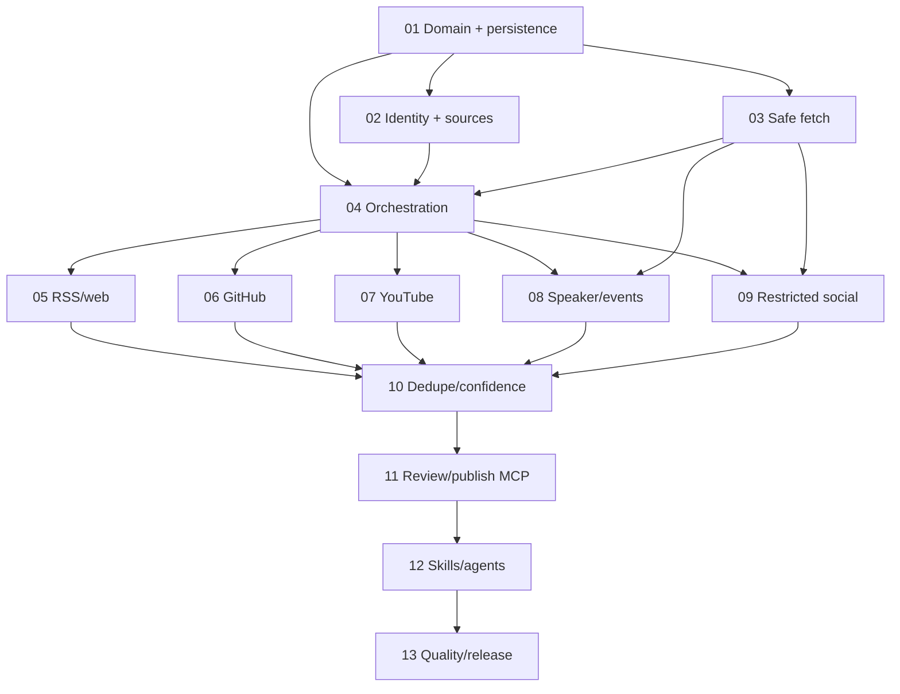
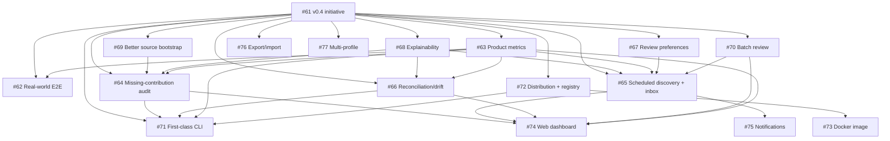

# Roadmap — GitHub Stars contribution intelligence

## Completed milestone — v0.3.0 Autonomous contribution discovery

**Epic:** #16
**Mode:** brownfield / standard
**Issue policy:** Phases 01-07 were seeded (#17-#23). Phases 08-13 were created just-in-time from their GSD packets.

### v0.3 dependency map

| Phase | Goal | Requirements | Issue | Blocked by | Status |
| --- | --- | --- | --- | --- | --- |
| 01 | Define discovery domain, lifecycle and SQLite persistence | DOMAIN-01..04 | #17 | — | verified; PR #25 |
| 02 | Bootstrap/manage trusted source identity | IDENT-01..04 | #18 | 01 | verified; PR #26 |
| 03 | Build safe fetch and untrusted-content boundary | SAFE-01..04 | #19 | 01 | verified; PR #27 |
| 04 | Orchestrate adapters into persisted candidates | DISC-01..04 | #20 | 01,02,03 | verified; PR #28 |
| 05 | Ship RSS/Atom + trusted website adapters | RSS-01..03 | #21 | 04 | verified; PR #29 |
| 06 | Ship GitHub discovery adapter | GH-01..04 | #22 | 04 | verified; PR #30 |
| 07 | Ship YouTube discovery adapter | YT-01..03 | #23 | 04 | verified; PR #31 |
| 08 | Ship public speaker/event adapters | SPEAK-01..03 | #32 | 03,04 | verified; PR #33 |
| 09 | Add compliant restricted-social ingestion | SOCIAL-01..03 | #35 | 03,04 | verified; PR #36 |
| 10 | Add dedupe, confidence and conflict resolution | DEDUPE-01..04 | #37 | 05-09 | verified; PR #38 |
| 11 | Expose review and publish MCP workflows | REVIEW-01..02, PUB-01..03 | #39 | 10 | verified; PR #40 |
| 12 | Package reusable skills/agent workflows | AGENT-01..05 | #41 | 11 | verified; PR #42 |
| 13 | Add evals, observability, docs and release proof | QUAL-01..02, OBS-01, DOC-01, REL-01 | #43 | 12 | verified; PR #45; gate run #91 |

### v0.3 phase exit criteria

#### 01 — Domain and persistence
Provider-neutral models, lifecycle rules, repository ports and SQLite round-trip are deterministic and tested. **Verified in PR #25.**

#### 02 — Identity and source registry
Profile/link bootstrap creates canonical sources with explicit ownership confidence; inferred sources cannot silently become trusted. **Verified in PR #26.**

#### 03 — Safe fetch
SSRF/redirect/size/content-type controls pass hostile fixtures; fetched data cannot override agent instructions or leak secrets. **Verified in PR #27.**

#### 04 — Orchestration
A fake adapter can run end-to-end into persisted candidates/evidence; one adapter failure does not corrupt others; cursors resume idempotently. **Verified in PR #28.**

#### 05 — RSS/web
Feeds and trusted personal sites create normalized article/blog candidates, including malformed/duplicate/incremental cases. **Verified in PR #29.**

#### 06 — GitHub
Supported APIs yield explainable, non-spammy candidates with stable URLs and tested pagination/rate-limit behavior. **Verified in PR #30.**

#### 07 — YouTube
Trusted channels sync through API/feed paths, preserve evidence and report credential/quota limits explicitly. **Verified in PR #31.**

#### 08 — Speaker/events
At least Sessionize/Pretalx-style public session sources are supported; generic event pages remain bounded to trusted URLs. **Verified in PR #33.**

#### 09 — Restricted social
No core scraping path exists. Explicit URLs/exports/supported APIs feed the common pipeline and unsupported capabilities are clear. **Verified in PR #36.**

#### 10 — Dedupe/confidence
Every candidate is matched against Stars and queue state with inspectable fingerprints/reasons; exact duplicates are blocked, ambiguous matches stay reviewable and Stars-unavailable runs cannot infer a clear duplicate state. **Verified in PR #38.**

#### 11 — Review/publish MCP
Users can list, edit, approve/reject/defer and publish; publish rechecks duplicates/policy and persists provenance. **Verified in PR #40.**

#### 12 — Skills/agents
Four thin workflows compose MCP/application tools instead of duplicating business rules, and untrusted text has no policy/write authority. **Verified in PR #42; implementation gate run #86.**

#### 13 — Quality/release
Offline gates, labeled eval corpus, privacy-safe telemetry, docs and release evidence support a truthful autonomous-discovery milestone. **Verified in PR #45; implementation/release gate run #91.**

### v0.3 milestone exit

A user can bootstrap trusted sources, discover candidates from supported open/official adapters, inspect evidence and duplicate/confidence reasons, record review decisions and publish approved contributions through Stars REST/MCP. The milestone does not depend on X/LinkedIn scraping, model text cannot directly publish, and provenance is retained. The GSD milestone name remains v0.3.0 while the package line is already 0.3.1; no package-version downgrade is implied.

---

## Candidate milestone — v0.4 Real-world contribution intelligence and operator UX

**Initiative:** #61
**Mode:** brownfield / evidence-first
**Planning status:** proposed portfolio; create detailed phase packets only when an item moves into execution.

The v0.3 architecture is intentionally reused. v0.4 should prove that the system is useful on real profiles before expanding into more surfaces. The roadmap therefore separates **product correctness/usefulness**, **continuous operation**, **operator efficiency**, **distribution**, and **later surfaces**.

### Sizing vocabulary

| Type | Meaning in this repository | Typical delivery shape |
| --- | --- | --- |
| initiative | Milestone/outcome spanning several capabilities and release decisions | many epics/features |
| epic | Capability that decomposes into multiple independently useful slices | usually 3+ focused PRs/features |
| feature | One bounded vertical user-visible capability | usually 1–2 focused PRs |
| task | Bounded engineering/docs/ops work with no independent user capability | usually one small PR/action |

Sizing is about **scope shape**, not calendar estimates. A feature may still be technically difficult; an epic is classified by decomposition and product breadth.

### Priority lanes

- **P0 — prove usefulness:** real-world E2E, product metrics, missing-contribution audit.
- **P1 — continuous/trustworthy operation:** scheduled inbox, reconciliation, preferences, explainability, source bootstrap, batch review.
- **P2 — adoption/distribution:** CLI and low-friction package/registry distribution.
- **P3 — explicit later backlog:** Docker, dashboard, notifications, export/import, multi-profile. These ideas are retained deliberately but are not committed v0.4 exit scope.

### v0.4 dependency map

The diagram expresses useful sequencing, not hard blockers in every case. In particular, #62 can start immediately and may feed defects back into any other item.

### Portfolio and sizing

| Priority | Type | Capability | Issue | Why this size | Suggested decomposition / status |
| --- | --- | --- | --- | --- | --- |
| P0 | feature | Controlled real-world E2E validation | #62 | one bounded product proof crossing existing layers | 1–2 PRs + evidence; start first |
| P0 | feature | Privacy-safe product quality metrics | #63 | one measurement capability over existing state/telemetry | 1–2 PRs; establish before broad claims |
| P0 | epic | Audit Stars profile for missing contributions | #64 | historical scan + coverage + compare + report + review handoff | 3–5 slices/PRs |
| P1 | epic | Scheduled discovery and review inbox | #65 | scheduling + run coordination + inbox + retention/ops | 3–4 slices/PRs |
| P1 | epic | Stars/source reconciliation and drift detection | #66 | matching + drift taxonomy + proposals + guarded update | 3–4 slices/PRs |
| P1 | feature | Learn explicit review preferences | #67 | bounded rules/preferences layer over existing decisions | 1–2 PRs |
| P1 | feature | Explain every candidate/duplicate/confidence decision | #68 | one reusable explanation contract over existing evidence | 1–2 PRs |
| P1 | feature | Improve identity/source bootstrap | #69 | extension of existing source registry, not a new subsystem | 1–2 PRs |
| P1 | feature | Batch review with per-candidate safety | #70 | one operator action family over current lifecycle | 1–2 PRs |
| P2 | epic | First-class CLI | #71 | several command families + output/config/mutation UX | 3–5 PRs |
| P2 | epic | PyPI Trusted Publishing, MCP Registry and install UX | #72 | multiple external distribution channels + release consistency | 2–4 PRs + external setup |
| P3 | feature | Hardened Docker image | #73 | supported deployment capability, larger than a Dockerfile task | 1–2 PRs |
| P3 | epic | Web dashboard | #74 | new interaction surface across multiple product capabilities | multiple frontend/backend slices |
| P3 | feature | Optional actionable notifications | #75 | one event-delivery capability over #65 | 1–2 PRs after #65 |
| P3 | feature | Portable export/import | #76 | one versioned state-exchange capability | 1–2 PRs |
| P3 | epic | Multi-profile/workspace isolation | #77 | cross-cutting storage/config/scheduling/operator changes | multiple PRs; only with real use case |

### Product metrics and evidence gates

#63 is intentionally early. The project should not optimize for raw publication volume. Useful measures include:

- discovered candidate count by source/type;
- eligible vs rejected/noise ratio;
- exact/likely duplicate rate;
- approve/edit/reject/defer rates;
- candidate acceptance rate by adapter/type;
- missing-audit yield and audited-source coverage;
- source LIMITED/UNAVAILABLE/error/rate-limit rate;
- material reconciliation findings by class;
- review queue age/time-to-decision where locally measurable;
- labeled false-positive/false-negative outcomes from eval/real-world evidence;
- dry-run-to-publish conversion only as a workflow diagnostic, never as a KPI encouraging writes.

Metrics remain privacy-safe: no titles, descriptions, page bodies, prompts, tokens or unnecessary URLs in telemetry. Empty/partial source coverage must not be presented as high recall or completeness.

### P0 exit candidate — prove usefulness

Before treating v0.4 as an expansion milestone, require:

1. #62 runs the existing flow against an explicitly authorized real profile/source set with sanitized evidence.
2. #63 defines product-quality metrics and establishes a baseline without content leakage.
3. #64 can answer “what appears to be missing for this bounded period?” while reporting coverage gaps and uncertainty.
4. Findings from #62 are converted into focused defects/features rather than bypassed in the test harness.

### P1 exit candidate — continuous and trustworthy operation

- repeat discovery can run incrementally without overlapping-run corruption;
- a review inbox exposes new/unreviewed/deferred work without auto-approval;
- existing Stars entries can be reconciled against source drift with guarded proposals;
- explanations are structured and evidence-backed;
- preferences reduce noise but cannot grant write authority;
- batch review preserves per-candidate lifecycle/audit semantics.

### P2 exit candidate — lower adoption friction

- a non-MCP user can operate core application flows through a thin CLI;
- a clean environment can install and launch a released artifact outside the repository checkout;
- package publication uses OIDC/Trusted Publishing rather than a long-lived PyPI secret;
- current MCP Registry publication requirements are evaluated and used if the project is eligible;
- #60 may reuse the stable published launcher for Agent Plugins packaging, but remains a separate track.

### P3 backlog policy

#73–#77 stay visible in the roadmap even though they are not currently prioritized. Do not create implementation phase packets for them until a concrete use case or earlier milestone evidence justifies the extra surface area.

### Parallel non-v0.4 tracks

These remain intentionally separate from the product roadmap:

- #57 — upstream MCP Skills findings/maintainer follow-up;
- #58 — real-client interoperability and host-activation evidence;
- #60 — portable Agent Plugins `mcp.json` packaging and credential-safe bootstrap;
- #96 — MCP prompts surface placement decision and host-activation evidence. The capability itself is already merged (PR #88, PR #95); this track only decides whether it becomes an explicit v0.4 operator-efficiency slice or stays an adjacent, documented capability.

Their results may change implementation choices in #71/#72, but they are not silently absorbed into the v0.4 initiative.

### v0.4 milestone exit candidate

A user can audit an existing Stars profile for missing/outdated contributions, run repeat discovery incrementally, understand why every candidate or reconciliation proposal exists, efficiently review the resulting queue, and install/run the tool through at least one low-friction supported distribution path. Claims are backed by real-world evidence and privacy-safe product metrics, while approval/publication remains explicit and deterministic.
