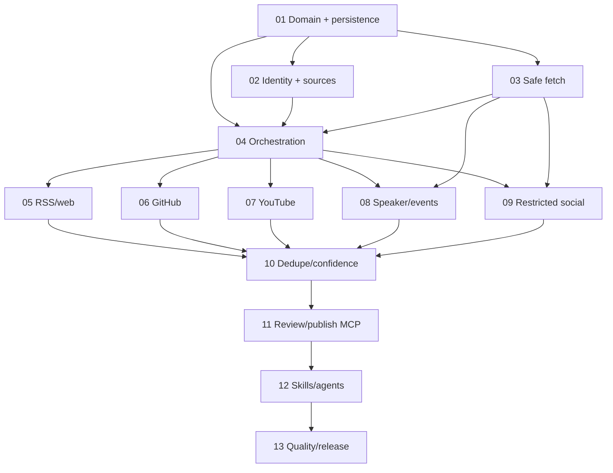

# Roadmap — v0.3.0 Autonomous contribution discovery

**Epic:** #16
**Mode:** brownfield / standard
**Issue policy:** Phases 01-07 are seeded (#17-#23). Phases 08-13 are created just-in-time from these packets.

## Dependency map

| Phase | Goal | Requirements | Issue | Blocked by | Status |
| --- | --- | --- | --- | --- | --- |
| 01 | Define discovery domain, lifecycle and SQLite persistence | DOMAIN-01..04 | #17 | — | verified; PR #25 |
| 02 | Bootstrap/manage trusted source identity | IDENT-01..04 | #18 | 01 | verified; PR #26 |
| 03 | Build safe fetch and untrusted-content boundary | SAFE-01..04 | #19 | 01 | verified; PR #27 |
| 04 | Orchestrate adapters into persisted candidates | DISC-01..04 | #20 | 01,02,03 | verified; PR #28 |
| 05 | Ship RSS/Atom + trusted website adapters | RSS-01..03 | #21 | 04 | verified; PR #29 |
| 06 | Ship GitHub discovery adapter | GH-01..04 | #22 | 04 | verified; PR #30 |
| 07 | Ship YouTube discovery adapter | YT-01..03 | #23 | 04 | ready after #30 |
| 08 | Ship public speaker/event adapters | SPEAK-01..03 | JIT | 03,04 | planned |
| 09 | Add compliant restricted-social ingestion | SOCIAL-01..03 | JIT | 03,04 | planned |
| 10 | Add dedupe, confidence and conflict resolution | DEDUPE-01..04 | JIT | 05-09 | planned |
| 11 | Expose review and publish MCP workflows | REVIEW-01..02, PUB-01..03 | JIT | 10 | planned |
| 12 | Package reusable skills/agent workflows | AGENT-01..05 | JIT | 11 | planned |
| 13 | Add evals, observability, docs and release proof | QUAL-01..02, OBS-01, DOC-01, REL-01 | JIT | 12 | planned |

## Phase exit criteria

### 01 — Domain and persistence
Provider-neutral models, lifecycle rules, repository ports and SQLite round-trip are deterministic and tested. **Verified in PR #25.**

### 02 — Identity and source registry
Profile/link bootstrap creates canonical sources with explicit ownership confidence; inferred sources cannot silently become trusted. **Verified in PR #26.**

### 03 — Safe fetch
SSRF/redirect/size/content-type controls pass hostile fixtures; fetched data cannot override agent instructions or leak secrets. **Verified in PR #27.**

### 04 — Orchestration
A fake adapter can run end-to-end into persisted candidates/evidence; one adapter failure does not corrupt others; cursors resume idempotently. **Verified in PR #28.**

### 05 — RSS/web
Feeds and trusted personal sites create normalized article/blog candidates, including malformed/duplicate/incremental cases. **Verified in PR #29.**

### 06 — GitHub
Supported APIs yield explainable, non-spammy candidates with stable URLs and tested pagination/rate-limit behavior. **Verified in PR #30.**

### 07 — YouTube
Trusted channels sync through API/feed paths, preserve evidence and report credential/quota limits explicitly.

### 08 — Speaker/events
At least Sessionize/Pretalx-style public session sources are supported; generic event pages remain bounded to trusted URLs.

### 09 — Restricted social
No core scraping path exists. Explicit URLs/exports/supported APIs feed the common pipeline and unsupported capabilities are clear.

### 10 — Dedupe/confidence
Every candidate is matched against Stars and queue state with inspectable fingerprints/reasons; ambiguous matches remain conflicts.

### 11 — Review/publish MCP
Users can list, edit, approve/reject/defer and publish; publish rechecks duplicates/policy and persists provenance.

### 12 — Skills/agents
Four thin workflows compose MCP/application tools instead of duplicating business rules, and untrusted text has no policy/write authority.

### 13 — Quality/release
Offline gates, labeled eval corpus, privacy-safe telemetry, docs and release evidence support a truthful v0.3.0 release.

## Milestone exit

A user can bootstrap trusted sources, discover candidates from supported open/official adapters, inspect evidence and duplicate/confidence reasons, record review decisions and publish approved contributions through Stars REST/MCP. The milestone does not exit if it depends on X/LinkedIn scraping, if model text can directly publish, or if provenance is lost.
